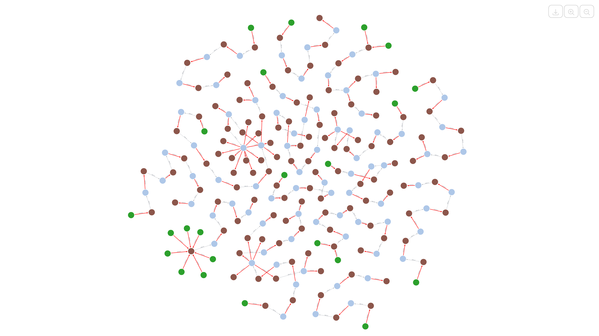

# UK Corporate Governance & UBO Analysis with Neo4j

This repo implements a high-throughput **KYC (Know Your Customer)** and **AML (Anti-Money Laundering)** knowledge graph pipeline using **UK Companies House** data.

By transitioning from flat, tabular registry data to a connected graph structure, this graph approach enables organizations to instantly traverse ownership structures, identify **Ultimate Beneficial Owners (UBOs)**, detect high-risk ["Russian Doll"](https://www.mondaq.com/unitedstates/securities/1424234/the-unravelling-of-the-matryoshka-doll-impact-of-the-cta-on-entities-having-nexus-to-the-us) corporate structures, and visualize the geospatial footprint of the UK economy.

<p align="center">
  
  <br>
  <sub>The voting rights of an expanded network of control.</sub>
</p>

## The Business Background

Identifying the [Ultimate Beneficial Owner (UBO)](https://www.swift.com/risk-and-compliance/know-your-customer-kyc/ultimate-beneficial-owner-ubo) is a cornerstone of modern compliance frameworks across the financial, insurance, and risk management sectors. It is no longer sufficient to simply know the immediate legal entity acting as a customer - organizations must pierce the corporate veil to understand the individuals who truly profit from and control these entities. This requirement is driven by increasingly stringent global regulations aimed at curbing money laundering, terrorist financing, and tax evasion. Failing to accurately identify UBOs exposes institutions to severe reputational damage and regulatory fines, making due diligence not just a legal obligation but a critical component of operational risk management.

In this context, traditional relational databases often struggle to capture the complex, multi-layered ownership structures used to obscure true control. These systems typically rely on rigid table structures that make traversing deep hierarchies of shell companies and trusts computationally expensive and difficult to visualize. A graph-based approach, such as that offered by Neo4j, fundamentally changes this dynamic by treating companies, people, and their relationships as first-class citizens. By modeling data as a network of connected nodes, Neo4j allow analysts to instantly traverse intricate ownership chains and uncover hidden patterns of influence, such as circular ownership or "Russian Doll" structures, that would otherwise remain invisible in tabular data. This capability empowers compliance teams to conduct more effective investigations, reduce false positives, and proactively manage risk with greater speed and precision.

<p align="center">
  
  <br>
  <sub>"Russian doll" like corporate structures in UK companies.</sub>
</p>

## The Stack

- **Neo4j Graph Database:** The core engine for storing and querying connected governance data.
- [**Apache Spark (PySpark):**](https://spark.apache.org/) Used for high-performance ETL, capable of processing millions of company and officer records efficiently.
- [**Neo4j Connector for Apache Spark:**](https://neo4j.com/developer/spark/) Enables high-throughput data transfer between Spark DataFrames and Neo4j.
- [**PyDeck:**](https://pydeck.gl/) Utilized for high-fidelity 3D geospatial visualizations (Heatmaps, ArcLayers, ColumnLayers).
- [**pgeocode:**](https://pypi.org/project/pgeocode/) Used within Spark UDFs to batch-geocode UK postcodes into latitude/longitude coordinates.

## The Dataset

To illustrate rich UBO and other corporate governance insights, our pipeline consumes public data from **Companies House (UK)**. Specifically:

- [**Basic Company Data:**](https://download.companieshouse.gov.uk/en_output.html) Foundational details (Name, Status, Incorporation Date, SIC Codes) for over 5 million companies.
- [**Persons with Significant Control (PSC):**](https://download.companieshouse.gov.uk/en_pscdata.html) A snapshot detailing the beneficial ownership structures, linking individuals and organizations to the companies they control.

Customers can easily swap in other datasets (internal or external) by modifying the data ingestion layer, making this pipeline adaptable to various jurisdictions and data sources.

## The Graph Model

The ETL pipeline transforms raw CSV and JSON data into a rich property graph. The schema allows for complex traversals regarding control, location, and industry classification.

<p align="center">
  
  <br>
  <sub>The schema of the property graph representing UK corporate governance.</sub>
</p>

### Nodes

* **`Company`**: Registered business entities.
* **`Person`**: Individual officers or beneficial owners (enriched with deterministic IDs based on name and DOB).
* **`Organization`**: Corporate entities that control other companies (e.g., holding companies).
* **`Address`**: Physical locations, enriched with Geolocation (Lat/Lon).
* **`Country`**: Jurisdictions of residence or origin.
* **`SICCode`**: Standard Industrial Classification codes representing economic activity.
* **`CompanyStatus`**: E.g., "Active", "Liquidation", "Dissolved".
* **`PreviousName`**: Historical names of companies, linked to track identity changes over time.

### Relationships

* `(:Person|:Organization)-[:CONTROLS]->(:Company)`: Represents beneficial ownership. Enriched with parsed voting rights and share percentages (e.g., `voting_rights_min: 25`, `voting_rights_max: 50`).
* `(:Company)-[:REGISTERED_AT]->(:Address)`: Physical footprint of the business.
* `(:Company)-[:HAS_STATUS]->(:CompanyStatus)`: Current legal status of the company.
* `(:Company)-[:REGISTERED_IN]->(:Country)`: Jurisdiction of incorporation.
* `(:Person)-[:LIVES_AT]->(:Address)`: Residence of the controller.
* `(:Company)-[:HAS_SIC]->(:SICCode)`: Classification of business activity.
* `(:Company)-[:HAS_PREVIOUS_NAME]->(:PreviousName)`: Tracks corporate history.

<p align="center">
  
  <br>
  <sub>Visualization of control outflows of UK companies.</sub>
</p>

## Notebooks

The project is divided into three primary notebooks, handling data ingestion, graph analysis, and geospatial intelligence.

### Data Loader & ETL ([`loader.ipynb`](loader.ipynb))

This notebook features a robust PySpark pipeline designed to ingest and clean UK corporate registry data. It employs Pandas UDFs to implement batch geocoding, efficiently converting UK postcodes into geospatial coordinates. The pipeline also handles control parsing by transforming unstructured strings, such as "voting-rights-25-to-50-percent," into queryable numerical ranges. To prevent data duplication, it uses entity resolution to generate deterministic unique IDs based on MD5 hashes for people and addresses. Furthermore, schema enforcement is applied through Neo4j constraints to guarantee data integrity prior to loading.

### UBO & Control Analysis ([`ubo.ipynb`](ubo.ipynb))
The analysis in this notebook demonstrates how to query the graph to identify beneficial owners and analyze complex control structures. It identifies majority indirect control relationships by isolating instances where voting rights exceed specific thresholds. The analysis visualizes control strength using graph techniques to color-code and resize edges according to the percentage of shares or voting rights held. Additionally, the notebook detects indirect control through "Bridge" structures, where an individual controls a target company via an intermediary, and uses recursive queries to uncover "Russian Doll" structures—deep, multi-layered ownership chains often utilized to obscure true ownership.

### Geospatial Intelligence ([`geo.ipynb`](geo.ipynb))

This notebook leverages the spatial data enriched during the loading phase to visualize broader economic patterns. It utilizes 3D column maps to display company density, effectively visualizing the concentration of registered businesses across the UK. The analysis includes liquidation heatmaps to identify geographic clusters of business failures and potential "phoenixing" hotspots. It also maps dominant industries via SIC codes to highlight specific clusters, such as the technology sector in Shoreditch or finance in Canary Wharf. Furthermore, the notebook visualizes cross-border outflows using 3D ArcLayers to track ownership flows from UK assets to foreign jurisdictions, specifically highlighting connections to tax havens.

Additionally, interactive renderings can be found in the `renderings/` directory, showcasing the dynamic and geospatial visualizations generated from the graph data. You can download HTML files of the visualizations and open them in a web browser to explore the interactive features.

### Fraud Patterns ([`fraud.ipynb`](fraud.ipynb))

Here we focus on identifying potential illicit activity by analyzing structural and geospatial anomalies within the corporate network. The notebook investigates "Registration Factories" by calculating the density of company registrations at individual addresses, visualizing extreme outliers that may indicate company mills or fraudulent shell company farms. It also implements graph algorithms to detect "Circular Ownership" loops, where ownership chains are engineered to loop back on themselves—a sophisticated technique often used to artificially inflate capital or decapitate the ownership structure to hide the Ultimate Beneficial Owner. Finally, the analysis maps the "Offshore Nexus," visualizing the concentration of control flowing from high-secrecy jurisdictions like Jersey and Guernsey to specific UK districts, helping to pinpoint clusters of assets that may be involved in capital flight or tax evasion.

Here we focus 

<p align="center">
  
  <br>
  <sub>Dynamic visualization of the density of financial industry businesses across London.</sub>
</p>

## Setup & Configuration

### Prerequisites

* Python 3.10+
* Neo4j Database (AuraDB or Desktop)
* Apache Spark (local or cluster)

### Environment Variables

Create a `.env` file in the root directory with the following credentials:

```bash
NEO4J_URI=bolt://localhost:7687
NEO4J_USER=neo4j
NEO4J_PASSWORD=your_password
NEO4J_DATABASE=neo4j
DATA_PATH=./data
COMPANIES_URL=http://download.companieshouse.gov.uk/BasicCompanyDataAsOneFile-202X-XX-XX.zip
PSC_URL=http://download.companieshouse.gov.uk/psc-snapshot-202X-XX-XX.zip

```

### Installation

Install the required dependencies:

```bash
pip install pyspark neo4j pgeocode pydeck pandas python-dotenv
```

Or use the provided `environment.yml` for a Conda environment:

```bash
conda env create -f environment.yml
```

### Running the Pipeline

1. Run [`loader.ipynb`](loader.ipynb) to download data, process it with Spark, and populate the Neo4j graph.
2. Run [`ubo.ipynb`](ubo.ipynb) to perform graph traversals and identify beneficial owners.
3. Run [`geo.ipynb`](geo.ipynb) to generate geospatial visualizations.